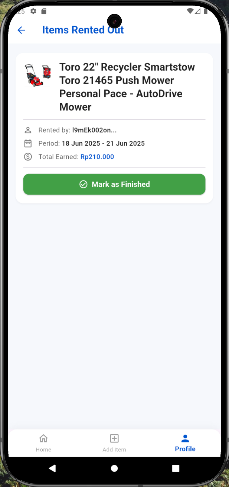

# PakeAja

PakeAja is a Flutter-based mobile application designed to facilitate item rentals. Users can list their items for rent, browse available items, manage their rentals, and connect with other users. This project aims to provide a seamless and intuitive platform for a peer-to-peer rental marketplace.

## Features

*   **User Authentication:** Secure registration and login.
*   **Item Listing:** Users can add, edit, and manage their items for rent.
*   **Item Browsing:** Discover items available for rent with search and filtering options.
*   **Rental Management:** Track currently rented items and items rented out.
*   **User Profiles:** View and manage user profiles.
*   **Firebase Integration:** Backend powered by Firebase for authentication, database, and storage.

## Getting Started

Follow these instructions to get a copy of the project up and running on your local machine for development and testing purposes.

### Prerequisites

*   [Flutter SDK](https://flutter.dev/docs/get-started/install) (version 3.7.2 or higher recommended)
*   [Firebase CLI](https://firebase.google.com/docs/cli#install_the_firebase_cli)
*   [Node.js](https://nodejs.org/en/download/) (for Firebase CLI)
*   [Android Studio](https://developer.android.com/studio) or [VS Code](https://code.visualstudio.com/) with Flutter and Dart plugins.

### Installation

1.  **Clone the repository:**
    ```bash
    git clone https://github.com/your-username/PakeAja.git # Replace with your actual repo URL
    cd PakeAja
    ```

2.  **Install Flutter dependencies:**
    ```bash
    flutter pub get
    ```

### Running the Application

To run the application on a connected device or emulator:

```bash
flutter run
```

## Firebase Setup

This project uses Firebase. To get started, you'll need to set up your Firebase project and configure the necessary files.

1.  **Create a Firebase Project:**
    If you don't have one already, create a new project on the [Firebase Console](https://console.firebase.google.com/).

2.  **Configure `google-services.json` (Android):**
    *   In your Firebase project, add an Android app.
    *   Follow the instructions to download your `google-services.json` file.
    *   Place this file in `android/app/google-services.json`.
    *   You can use `android/app/google-services.json.example` as a reference for the required structure.

3.  **Configure `firebase_options.dart` (FlutterFire):**
    *   Install the Firebase CLI: `npm install -g firebase-tools`
    *   Log in to Firebase: `firebase login`
    *   From the root of your project, run the FlutterFire CLI command to generate `firebase_options.dart`:
        `flutterfire configure`
    *   This will generate the `lib/firebase_options.dart` file with your project-specific configurations.
    *   You can use `lib/firebase_options.dart.example` as a reference for the required structure.

**Important:** Ensure that your `google-services.json` and `firebase_options.dart` files are **not** committed to your Git repository. They should be ignored by Git (e.g., by adding them to your `.gitignore` file).

## Project Structure

```
lib/
├── models/          # Data models (e.g., Category, Item, Rental, User)
├── providers/       # State management (e.g., AuthProvider, ItemProvider)
├── screens/         # UI screens (e.g., HomeScreen, LoginScreen, AddItemScreen)
├── services/        # Backend service integrations (e.g., AuthService, ItemService)
├── utils/           # Utility functions (e.g., currency formatting)
└── widgets/         # Reusable UI widgets
```

## Screenshots




